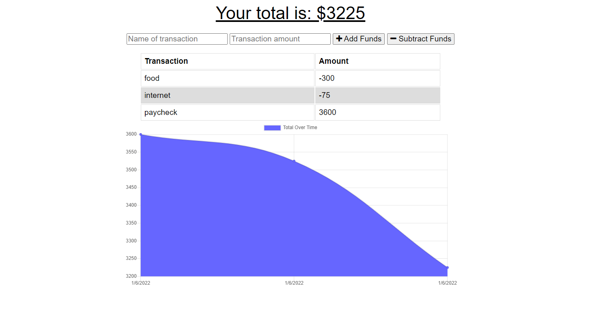

# Anytime_budget_19

## Description:

Budget Tracker is a progressive web application that allows users to track their budgets by adding expenses and deposits to their budget through the "Add/Subtract Funds" buttons.
The user able to add expenses and deposits to their budget with or without a connection.
If the user enters transactions offline, the total should be updated when they're brought back online.

##  Table of Contents

* [Demo](#demo)
* [Technology](#technology)
* [Usage](#usage)
* [License](#license)
* [Questions](#questions)

***GITHUB***

* Repository link: [https://github.com/Tari-Star/Anytime_budget_19](https://github.com/Tari-Star/Anytime_budget_19.git)

***HEROKU***

* Heroku app: [https://anytime-budget-19.herokuapp.com/](https://anytime-budget-19.herokuapp.com/)

## Demo:

 ## Technology:
 > Links ( click on titles )

 **1. [Node.js ](https://nodejs.org/en/):**

* Node.js is an open-source and cross-platform JavaScript runtime environment. 

* A Node.js app is run in a single process, without creating a new thread for every request. 

* Node.js provides a set of asynchronous I/O primitives in its standard library that prevent JavaScript code from blocking.

**2. [Express.js](https://expressjs.com/):**

* Web Applications : Express is a minimal and flexible Node.js web application framework that provides a robust set of features for web and mobile applications.

* APIs : With a myriad of HTTP utility methods and middleware, creating a robust API is quick and easy.

* Performance : Express provides a thin layer of fundamental web application features, without obscuring Node.js features.

**2.[MongoDB](https://www.mongodb.com/)**

* MongoDB is an open source NoSQL database management program. NoSQL is used as an alternative to traditional relational databases. NoSQL databases are quite useful for working with large sets of distributed data. MongoDB is a tool that can manage document-oriented information, store or retrieve information

**3.[Mongoose](https://www.npmjs.com/package/mongoose)**

* Mongoose is an Object Data Modeling (ODM) library for MongoDB and Node. js. It manages relationships between data, provides schema validation, and is used to translate between objects in code and the representation of those objects in MongoDB.

 ## Usage:

 * Clone GitHub repository
 * Run `npm init` in your terminal
 * Ensure that MongoDB and Express are installed on your computer
 * Invoke application using `npm start`

  ## License

    
***This project is licensed under the [MIT license](https://choosealicense.com/licenses/mit)***
    
---
   
 ## Questions?

   
  
  
  For any questions about the repo, please contact me with the information below :
  ---
  
 ***To open an issue :***
 
 GitHub/Issues: [@Tari-Star](https://github.com/Tari-Star/Anytime_budget_19/issues)

 ***Contact me directly :***
  
 Email: [tari.star.g@gmail.com](mailto:tari.star.g@gmail.com)